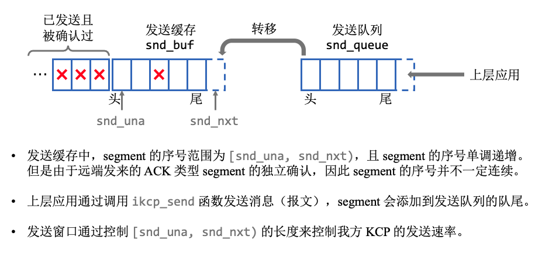
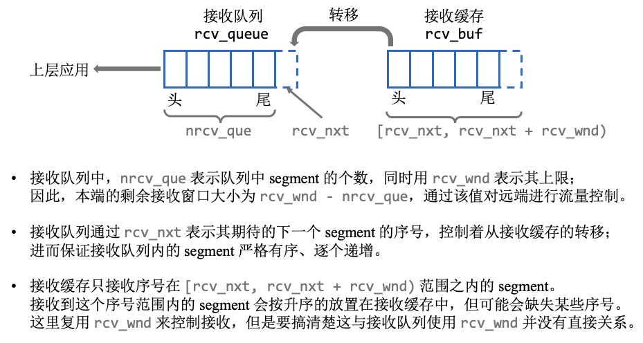

# 阅读 KCP 代码的笔记

## 发送队列和发送缓存
上层应用通过调用 ```ikcp_send``` 函数来发送消息（报文）。  
如下图所示，消息会被处理成若干 segment 放入到发送队列中。



KCP 协议主要通过 ```ikcp_update```、```ikcp_flush``` 和 ```ikcp_output``` 三个函数来实现 segment 的发送，  
上层应用需要循环调用 ```ikcp_update``` 来不定时地触发调用 ```ikcp_flush``` 函数，从发送队列往发送缓存中转移 segment 的过程就在 ```ikcp_flush``` 函数中，  
最后实际发送是通过调用 ```ikcp_output``` 来发送一连串的字节数据，但注意在该函数里最终是调用函数指针 ```kcp->output``` 来发送数据，因此需要提前设置好该 callback 函数。

KCP 协议同时采用累计确认和独立确认，其中累计确认通过收到的每个 segment 里的 una 字段实现，独立确认通过一个单独的 segment 类型来实现（即 ACK 类型 segment）。  
这两种确认都会对发送缓存产生影响，因为受到确认的 segment 没必要再保存，应当删除掉。

## 接收队列和接收缓存
当有来自下层的数据时，KCP 通过调用 ```ikcp_input``` 函数来收取来自下层的数据分组，然后解析出 segment，  
对于数据类型的 segment，会通过调用 ```ikcp_parse_data``` 函数尝试将其存放到接收缓存当中，然后再尝试从接收缓存往接收队列中转移节点，  
上层应用通过调用 ```ikcp_recv``` 函数来接收消息（报文），从接收队列中读取数据，然后再尝试从接收缓存往接收队列中转移节点。

